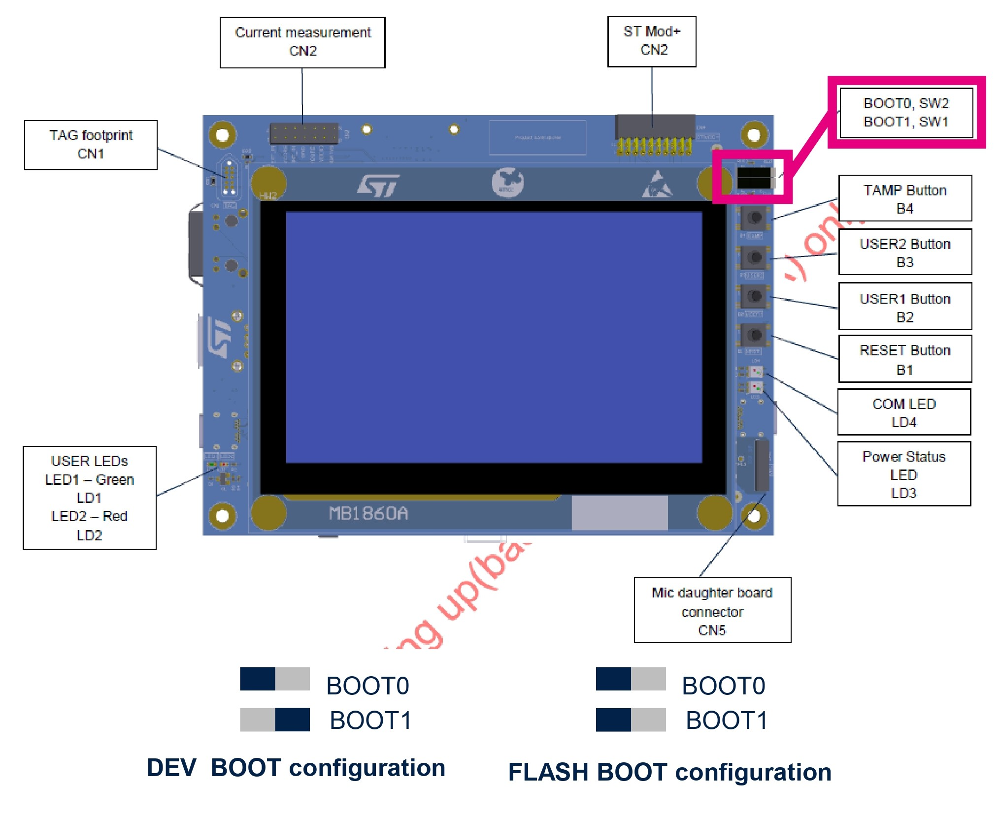

# FreeRTOS Template project for STM32N6570-DK


This repository provides a template project integrating **FreeRTOS** for you to get started with  **STM32N6** using the [STM32N6570-DK Discovery kit](https://www.st.com/en/evaluation-tools/stm32n6570-dk.html).

## STM32N6 specificities

STM32N6 devices are **Flashless** MCUs that provide several memory units for your FW to run.  
Because of this specificity, the procedure to create projects, flash and debug  is different than with other STM32 boards.

### Memory usage
STM32N6 devices allow you to load and execute your code from different memory units. You can either :
* **Load and execute** the FW from **internal memory SRAM**
* **Load** in one of the available type of **External Memory** Unit and **execute** the FW from **internal memory SRAM**
* **Load and execute** the FW from one **External Memory** Unit (XiP Execute in Place)

>In this repository we used the most common and easiest to work with setup :
we will **flash our binaries in the External Flash NOR memory unit and execute from the SRAM.**


### Projects structure
STM32N6 Projects available structures are the following :
* **FSBL only** : a First Stage Boot Loader that integrates your FW, assuming the FW is simple and lightweight
* **FSBL + Application** : FSBL is used to set up the application running depending on its location and can integrate minor tasks. The application is your FW.
* **FSBL + Non Secure Application + Secure Application** : same as previous adding a dedicated project and memory location to protect the Secure Application project content.

>In this repository we used the most common and easiest to work with project structure for N6 boards, the **FSBL + Application**.  In our project :
>* The FSBL is used to configure the **System Clock**
>* The App integrates **FreeRTOS**, and implements a **FreeRTOS tasks that toggles an LED**.

### FW execution workflow

* After a Reset, the integrated BootROM of the board executes.
* If the FSBL was loaded in an external flash, BootROM copies it from there into the SRAM.
    >This project case :  copies the FSBL from the NOR External flash 0x70000000 into the SRAM 0x34180000
* Jump from the BootROM into the FSBL and FSBL executes.
* If an application project was loaded in an external memory, then :
    * if running from external memory, sets up the execute in place,  
     otherwise copies the Application from the External memory into the SRAM.
        >This project case :  copies the Application from the NOR External flash 0x70100000 into the SRAM 0x034000000.

    * Jump from the FSBL into the Application
    * The Application executes

## Prerequisites

### Softwares
To be able to use **STM32N6** boards, you will need the following software tools with equal or newer versions :
* [STM32CubeMX](http://www.st.com/stm32cubemx) v6.13.0
* [STM32CubeIDE](https://www.st.com/stm32cubeide) v1.17.0
* [STM32CubeProgrammer](http://www.st.com/stm32cubeprog) v2.18.0

To clone this repo you will need [GitBash](https://git-scm.com/downloads).

### CMSIS packs
If you want to be able to modify the [STM32CubeMX](http://www.st.com/stm32cubemx) .ioc file of this project and be able to re-generate the code, you will need to download and install the follwing pack on STM32CubeMX.
* [ARM.CMSIS-FreeRTOS.11.1.0.pack](https://keilpack.azureedge.net/pack/ARM.CMSIS-FreeRTOS.11.1.0.pack)


## Running the project on your N6 board

### Clone the repository
Open a GitBash window in the location your want to import the project in and run the following commands :

```bash
git clone https://github.com/Ldupe/FreeRTOS_STM32N6570-DK.git
git submodule update --init --recursive
```
### Build the project

* Import the project folder *FreeRTOS_STM32N6570-DK* in [STM32CubeIDE](https://www.st.com/stm32cubeide).
* You should obtain one project containing the two subprojects *Appli* and *FSBL*. Build both of them.

### Flash the project

STM32N6 boards require binaries to be signed and flashed in a specific way. To do so :
* Connect your board to your PC using STLink




* Place the board BOOT switches in DEV_BOOT mode
* Hit the Reset button for the switch new position to be taken into account.
* Open a GitBash window in the *FreeRTOS_STM32N6570-DK* folder.  
  Run the following command in GitBash to run the *flash.sh* script that will sign and flash both the FSBL and Appli binaries into your board :

    ```bash
    sh flash.sh
    ```

    ***Script Troubleshoot***
    * *Try powercycling the board, make sure the switches are in DEV_BOOT mode, hit Reset and run the script again.  
    **This error happens often** and there is currently no available fix.*
    * *Make sure that the binary generation is enabled in both the FSBL and Appli project configuration :  
    Properties > C/C++ Build > Settings > MCU/MPU Post build outputs > Check "Convert to binary file" box*

* Place the board BOOT switches in FLASH_BOOT mode  :
* Hit the Reset button for the switch new position to be taken into account.

**The project should start running.  
You should see the Green LED1 toggling at the bottom left of the [STM32N6570-DK](https://www.st.com/en/evaluation-tools/stm32n6570-dk.html) board.**

## Debugging the project

You can debug the project in a way that allows you to monitor the **execution of the FSBL, the jump from the FSBL to the Application, and then the execution of the application.**  
To do so :

* **Flash** the binaries using the *flash.sh* script while in DEV_BOOT mode (See above)
* Leave the board in **DEV_BOOT** mode to be able to enter Debug.
* **Start the debug** session of the *Appli* project using STM32CubeIDE.  
**The Debug session wil start in the FSBL and you will be able to debug the FSBL, the jump and then the Application.**
* If you need to add **breakpoints**, right click where you want to put your breakpoint instead of a left click, then select *Add breakpoint* them select ***Hardware*** for *Type*.

The debug specific configuration should be already saved in the project so no other step is required.  
For you reference, here is the Debug Configuration being used to monitor both FSBL, the jump and the App :
* Select the Appli project > Debug As > Debug Configuration > Startup
* Add item > Select the FSBL project > Uncheck Build > Check Download
* Edit item > Select the Appli project > Uncheck Download


## Implement your changes

Using [STM32CubeMX](http://www.st.com/stm32cubemx)
* Make sure that you have downloaded and installed the pack [ARM.CMSIS-FreeRTOS.11.1.0.pack](https://keilpack.azureedge.net/pack/ARM.CMSIS-FreeRTOS.11.1.0.pack)
* Open the *FreeRTOS_STM32N6570-DK.ioc* file with [STM32CubeMX](http://www.st.com/stm32cubemx)
* Proceede to your changes to the FSBL and App and click *Generate Code* once finished
* Open the project in [STM32CubeIDE](https://www.st.com/stm32cubeide), build the FSBL and Appli projects and flash and debug as indicated above.

Using [STM32CubeIDE](https://www.st.com/stm32cubeide)
* Proceede to your changes in the FSBL and Appli project.
* Build the FSBL and Appli projects and flash and debug as indicated above.
